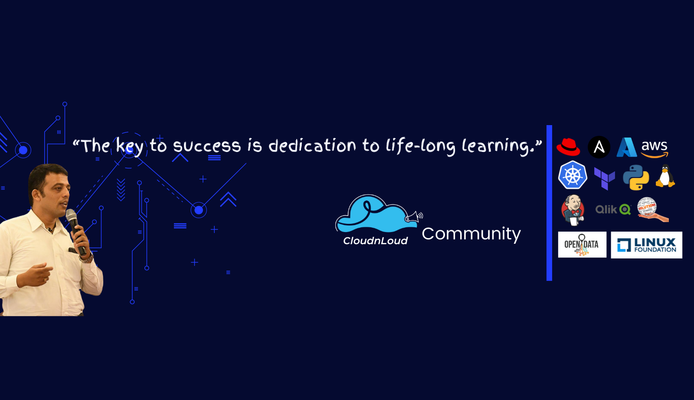

## What is this?

A collection of super-popular Interview questions, along with answers, and some code-snippets that will help you to prepare for technical interviews. Many of these questions are real questions from real interviews. It is by no means comprehensive, and the answers are relatively short ( and for each of the concepts, there are probably better and/or more in depth coverage in the web), but this repo like reference tool, that helps you to prepare for technical interview.

Note: Keep in mind that many of these questions are open-ended and could lead to interesting discussions that tell you more about the person's capabilities than a straight answer would.

## Table of Contents

### Topics

# Solution Architect 

+ [What need to be looked upon for any project before any solutioning ](./solution-architect/architecture.md)
+ [What kind of analysis need to be asked from business context point of view before any solutioning ](./solution-architect/business-context.md)
+ [What kind of assessment and need to have clear idea while engaging any partnership approach as part of any solutioning ](./solution-architect/partnership.md)
+ [As part of any project solutioning what are all need to be asked ](./solution-architect/project.md)
+ [As a solution architect what need to be analyzed in any project before solutioning ](./solution-architect/sdlc.md)
+ [As a solution architect in any solutioning what sort of technical requirement analysis to do ](./solution-architect/technical-requirements.md)

# Solution Architect - Technology

+ [In any kubernetes project what need to be asked ](./solution-architect/technology/compute/kubernetes.md)
+ [In any BlockChain project what need to be asked ](./solution-architect/technology/compute/blockchain.md)
+ [In any batchprocessing project what need to be asked ](./solution-architect/technology/compute/batch.md)
+ [In any DataBase migration project what need to be asked ](./solution-architect/technology/database/database.md)
+ [In any Data project what need to be asked ](./solution-architect/technology/data/azure-data-lake.md)

# LINUX Administration

+ [Simple Linux Questions](./linux/linux-interview-questions-part-1.md)
+ [Medium Linux Questions](./linux/linux-interview-questions-part-1.md)
+ [Hard Linux Questions](./linux/linux-interview-questions-part-1.md)
+ [Expert Linux Questions](./linux/linux-interview-questions-part-1.md)
+ [Networking Questions](./linux/linux-interview-questions-part-1.md)
+ [Linux Glance](./linux/linux-interview-questions-part-2.md)
+ [Test your Linux Skills](./linux/linux-interview-questions-part-3.md)
+ [Refresh your Linux Skills](./linux/linux-interview-questions-part-4.md)

# Ansible

+ [50 Ansible Assesments ](./ansible/50-ansible-tasks.md)
+ [100 Ansible realtime-playbooks ](./ansible/playbooks)

# Terraform Interview Questions

+ [Terraform Interview Questions Set 1](./terraform/terraform-interview-questions-part-1.md)

# AWS Solution Architect - Cloud Questions

+ [AWS Simple Questions](./aws/aws-interview-questions-part-1.md)
+ [AWS Deep Dive Questions](./aws/aws-interview-questions-part-2.md)
+ [AWS Use Case Assesment 1 ](./aws/Aws-Use-case-Testing-1.md)
+ [AWS 50 Assessment exercises ](./aws/exercises)
+ [AWS 50 Assessment Answers ](./aws/solutions)

# Azure Cloud

+ [AZURE Cloud Assessment 1](./azure/azure-interview-questions-part-1.md)

# DevOps

+ [DevOps Guide - Tools - HighLevel](./devops/DevOps-Guide.md)
+ [Validate yourself before interview](./devops/devops-hands-on-path.md)
+ [Validate yourself Self-Assesment](./devops/DevOps-Engineer-assignment.md)
+ [Validate yourself Deep Glance](./devops/DevOps-Deep-Glance-Again.md)

# Docker Container Interview Questions

+ [7 Assessment exercises ](./docker/exercises)
+ [7 Assessment Answers ](./docker/solutions)

# kubernetes Interview Questions

+ [Kubernetes Insights Glance](./k8s/kubernetes-workshop.md)
+ [Kubernetes Interview Questions Part1](./k8s/k8s-interview-questions-part-1.md)
+ [Kubernetes Interview Questions Part2](./k8s/k8s-interview-questions-part-2.md)
+ [Kubernetes Commands - Just Glance](./k8s/kubernetes-commands.md)
+ [How It's Works](./k8s/how-kubernetes-works.md)
+ [Revisit Cron Jobs](./k8s/kuberenets-cronjobs.md)
+ [Deep Dive Concepts](./k8s/kubernetes-concepts.md)
+ [Refresh admin commands](./k8s/kubernetes-commands-1.md)
+ [k8s Deployment Glance](./k8s/kubernetes-deployment-tutorial.md)
+ [Refresh volume admin Skill](./k8s/persistent-volume.md)
+ [7 Assessment exercises ](./k8s/exercises)
+ [7 Assessment Answers ](./k8s/solutions)

# Python Real Problems and Solutions

Each file begins with a problem statement. The rest of the file is the solution.

+ [1 problem](./python/binary_tree.py)
+ [2 problem](./python/combinations.py)
+ [3 problem](./python/find_path.py)
+ [4 problem](./python/find_tree_sum.py)
+ [5 problem](./python/first_non_repated)
+ [6 problem](./python/glaucoma_scanner.py)
+ [7 problem](./python/hashtable.py)
+ [8 problem](./python/lca.py)
+ [9 problem](./python/permutations.py)
+ [10 problem](./python/permute.py)
+ [11 problem](./python/reverse_string.py)
+ [12 problem](./python/set_some_bits.py)
+ [13 problem](./python/sum_file.py)
+ [14 problem](./python/tasks_for_servers.py)
+ [15 problem](./python/telephone.py)
+ [16 problem](./python/to_hex.py)

# Interview questions for Data Engineer

+ [Apache Airflow](./content/airflow.md)
+ [Apache Avro](./content/avro.md)
+ [Apache Cassandra](./content/cassandra.md)
+ [Apache Flume](./content/flume.md)
+ [Apache Hadoop](./content/hadoop.md)
+ [Apache Hive](./content/hive.md)
+ [Apache Impala](./content/impala.md)
+ [Apache Kafka](./content/kafka.md)
+ [Apache NiFi](./content/nifi.md)
+ [Apache Spark](./content/spark.md)
+ [Apache Flink](./content/flink.md)
+ [Apache Hbase](./content/hbase.md)
+ [Amazon Web Services](./content/aws.md)
+ [DWH Architectures](./content/dwha.md)
+ [Tableau](./content/tableau.md)
+ [Kubernetes](./content/kubernetes.md)
+ [SQL](./content/sql.md)
+ [Data Structures](./content/data-structure.md)

# MongoDB

+ [Explore MongoDB](./mongodb/mongodb.md)

# GIT - Source Code Management

+ [Explore GIT](./git/git.md)

### Find All Cloud/DevOps Architect Trainings with Step-by-Step Handson with Use cases:
- Click below Picture 👇

<h3 align="left">Connect with Me:</h3>

<h3 align="left">Connect with Us to know your talents:</h3>

